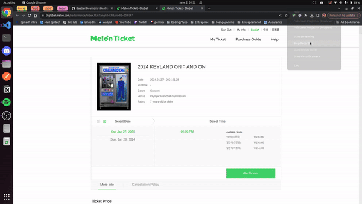

<div align="center">
    <h1>EasyConcertKorea</h1>
<br>
</div>

# 项目说明

## 项目结构

- `ticket-bot-plugin/`：Chrome MV3 插件源码。
  - `manifest.json`：插件权限、content script 注册、DNR 规则注册。
  - `background.js`：插件 Service Worker，负责座位接口需要的动态 `Referer` 请求头规则、主世界点击、截图等后台能力。
  - `rules.json`：YES24 antibot 脚本替换用的静态 DNR 规则。
  - `popup/`：插件弹窗页面、平台配置表单、卡片列表。
  - `scripts/common/`：各平台共用的 content script 工具。
  - `scripts/yes24/`、`scripts/thaiticket/`、`scripts/melonticket/`、`scripts/interpark/`：各平台自动化脚本。
- `TampermonkeyScript/`：油猴脚本目录，目前主要保留 YES24 流程和通用弹窗屏蔽脚本；Interpark 不再依赖油猴点击 Next。
- `local-services/`：本地辅助服务，目前包含 GLM-OCR 验证码识别服务。

## 本地文件

- Chrome 加载解压插件后可能生成 `ticket-bot-plugin/_metadata/`，该目录已被 git 忽略。
- YES24 调试时保存的页面快照，例如 `ticket-bot-plugin/scripts/yes24/page.html`，属于本地调试文件，已被 git 忽略。
- 非敏感的共享运行常量放在 `ticket-bot-plugin/config/config.js`。
- 本地备注或临时复制的敏感信息可以放在 `ticket-bot-plugin/config/local.json`，该文件已被 git 忽略，插件也不会主动加载。
- 飞书 Webhook、YES24 `idCustomer`、Interpark 联系人等运行时敏感信息通过插件卡片保存到 `chrome.storage.sync`，不要写死在脚本里。

## 手动启动 / 停止流程

- 在插件首页选择平台，新建或编辑抢票卡片。
- YES24 的 `idCustomer` 在 YES24 专属表单里的 `YES24 用户 ID` 字段填写，不再硬编码到 `scripts/yes24/seatv2.js`。
- Interpark 使用 NOL World 链接。`演出 ID / 链接` 可填写完整 NOL URL、`productId?placeCode=placeId`，或 `placeId/productId`；脚本不会再回退到任何测试演出 ID。
- 打开目标票务页面后，在插件首页点击对应卡片的 `开始`。
- 需要停止当前页面脚本时，点击同一卡片的 `停止`。
- 点击 `编辑` 会打开已保存配置，并回填原有信息；保存时会保留旧字段，避免插件更新后空字段覆盖已填信息。

## Interpark 更新说明

临时加更一集InterPark 希望Once们都能捡到安可票:D
页面为后台刷票，右下角的小框信息在更新说明刷票流程已启动

本地部署小模型后可以支持自动识别验证码填写
如果你不会部署 可以让你的CodeX/Claude code读本文档帮你做好

Interpark 已切到 NOL World 页面流程，配置、启停、验证码和后续确认页信息都通过插件卡片管理。

### 页面配置

- 在插件首页点击 `Interpark` 新建卡片，或在已有卡片上点 `编辑`。
- `演出 ID / 链接` 支持三种格式：
  - 完整 NOL 链接，例如 `https://world.nol.com/zh-CN/ticket/genre/CONCERT/products/26005759?placeCode=26000413`
  - `productId?placeCode=placeId`
  - `placeId/productId`
- `优先区域` 支持多个区域，用英文逗号分隔，例如 `001,004,025`。脚本会自动把 `1` 补成 `001`。
- `购票数量` 用于控制锁座和价格页选择的票数。
- `每轮间隔（毫秒）` 是一轮区域扫描结束后到下一轮的基础等待时间，默认 `2000`。
- `每轮随机抖动（毫秒）` 会叠加到每轮间隔上，默认 `600`，即实际等待约 `2000~2600ms`。
- `区域间隔（毫秒）` 是同一轮内从一个区域切到下一个区域前的等待时间，默认 `800`。
- `无指定区域时每轮最多扫描区域数` 只在 `优先区域` 为空时生效，默认扫页面列表前 `12` 个区域。
- `只刷前几排座位` 使用座位图视觉排计算，填 `0` 或留空表示不过滤；填 `3` 表示只尝试座位图从上到下前 3 排的可选座。
- `订购页超时重开（分钟）` 用于处理 Interpark 订购页有效期限制，默认 `9.5` 分钟；超过后会回到 NOL 演出详情页并重新开始订购流程，填 `0` 表示禁用。

### 联系人和确认页
自动填写联系人等信息

- `取票方式值`：默认可填 `24000`。
- `联系电话`
- `手机号`
- `Messenger 类型`：Wechat 使用 `SN004`。
- `Messenger ID`
- `填写确认信息后自动下一步`

姓名、生日、邮箱等账号固定信息不会被插件覆盖，仍以页面已带出的信息为准。

### 运行流程

1. 加载插件后，在 Interpark 卡片中保存演出、区域、轮询、联系人配置。
2. 打开对应 NOL 演出页。
3. 在插件首页点击该卡片的 `开始`。
4. 插件会模拟真实点击进入购票页、选择日期和时间。
5. 如果进入 `tickets.interpark.com/waiting` 排队页，插件会静默等待站点自动跳转，不会点击、刷新或开始刷座位。
6. 出现验证码时，优先调用本地 GLM-OCR 服务识别；服务不可用或识别失败时等待人工输入。
7. 验证通过后，脚本按配置区域轮询座位接口并尝试锁座。
8. 只有接口锁座成功后，才进入对应座位详情区并点击该座位；接口没锁到时不会进入座位详情区，会等待下一轮。
9. 选座成功后进入价格、配送确认页，自动填写卡片中的联系人信息，停在支付前流程。
10. 如果配置了飞书机器人 Webhook，锁座或选座成功会发送包含区域、视觉排、座位号的消息。
11. 如果订购页运行超过配置的超时时间，会保持运行状态并跳回 NOL 演出详情页，随后自动重新点击购买，开始新的订购窗口。

### 点击方式

Interpark 当前不依赖油猴脚本点击 Next。插件通过 `chrome.scripting.executeScript({ world: "MAIN" })` 在页面主世界执行点击和选座逻辑。

保留的 Tampermonkey 脚本主要用于其它平台或通用弹窗处理；Interpark 专用 `interpark-next-click.user.js` 已移除。

## GLM-OCR 本地验证码服务

本项目使用 [zai-org/GLM-OCR](https://github.com/zai-org/GLM-OCR) 做 Interpark 验证码本地识别。服务运行在本机，插件只请求 `127.0.0.1`，服务不可用时自动降级为人工输入验证码。

### 环境要求

- Windows + PowerShell。
- Python 虚拟环境：默认路径为仓库根目录下 `.venv`。
- 建议使用 NVIDIA 显卡和 CUDA 版 PyTorch；CPU 也能启动但识别速度会明显变慢。
- 需要能访问 Hugging Face 下载 `zai-org/GLM-OCR` 模型；首次启动会下载并加载模型。
- Chrome 插件需要已包含本地服务权限：`http://127.0.0.1/*`、`http://localhost/*`。

### 安装依赖

如果本地还没有 `.venv`，在仓库根目录执行：

```powershell
python -m venv .venv
.\.venv\Scripts\python.exe -m pip install -U pip
```

安装 CUDA 版 PyTorch 时，请按本机 CUDA 版本选择官方 wheel。示例：

```powershell
.\.venv\Scripts\python.exe -m pip install torch torchvision --index-url https://download.pytorch.org/whl/cu126
```

安装 GLM-OCR 服务所需 Python 包：

```powershell
.\.venv\Scripts\python.exe -m pip install -U transformers accelerate pillow protobuf sentencepiece tiktoken einops
```

### 启动服务

推荐使用仓库内脚本：

```powershell
.\local-services\start_glm_ocr_service.ps1
```

也可以直接运行：

```powershell
.\.venv\Scripts\python.exe local-services\glm_ocr_service.py
```

默认地址：

- 健康检查：`http://127.0.0.1:17861/health`
- OCR 接口：`http://127.0.0.1:17861/ocr`

健康检查示例：

```powershell
Invoke-RestMethod http://127.0.0.1:17861/health
```

正常返回会包含：

- `ok: true`
- `model: "zai-org/GLM-OCR"`
- `cuda: true/false`
- `device`: 当前使用的设备名称

### 插件配置

验证码服务配置在 `ticket-bot-plugin/config/config.js`：

```js
captchaOcr: {
    enabled: true,
    serviceUrl: 'http://127.0.0.1:17861/ocr',
    timeoutMs: 3000,
    retryIntervalMs: 8000,
    maxAttempts: 3,
    invalidRefreshDelayMs: 600,
    submitCheckDelayMs: 1200,
    codeLength: 6,
}
```

含义：

- `enabled`：是否优先尝试本地 OCR。
- `serviceUrl`：本地 OCR 服务地址。
- `timeoutMs`：单次 OCR 请求超时，超时后走人工输入。
- `retryIntervalMs`：同一张验证码重复识别失败后的重试间隔。
- `maxAttempts`：最多自动识别次数，超过后等待人工输入。
- `invalidRefreshDelayMs`：识别结果非法或页面提示验证码错误后，刷新验证码前后的等待时间。
- `submitCheckDelayMs`：提交验证码后等待页面反馈的时间。
- `codeLength`：当前 Interpark 验证码长度，现按 6 位大写英文字母处理。

### 识别和重试策略

- 插件会从验证码图片或页面截图中截取验证码，发送给本地服务。
- GLM-OCR 返回结果会被规范化成大写英文字母。
- 如果结果包含数字、少于 6 位，或不是 6 个字母，插件会刷新验证码并重试。
- 如果页面提示“请重新确认输入的文字”等验证码错误，插件也会刷新验证码并重试。
- OCR 服务未启动、请求超时、模型报错、超过最大重试次数时，插件会显示等待人工输入，不会阻塞手动操作。

### 性能参考

在已加载模型的 GPU 环境下，单张验证码通常约数百毫秒完成；首次启动需要加载模型，耗时会明显更长。实际速度取决于显卡、CUDA/PyTorch 版本和模型缓存状态。

### 注意事项

- 更新插件代码后，需要在 `chrome://extensions/` 重新加载插件。
- 更新 Tampermonkey 脚本后，需要在 Tampermonkey 面板中同步更新脚本。
- 如果浏览器扩展 ID 变化，`chrome.storage.sync` 中保存的卡片配置可能看起来像丢失；建议固定使用同一个解压目录加载插件。

## 2025-10-09 update
### feat:
- 更新Melon前端刷票
- 支持配置飞书webhook通知


## 2025-08-25 update
### feat:
- 更新ThaiTicket抢票助手，增加自定义配置页面和手动启停

### How to use
- 点击ThaiTicket页面先配置抢票信息
    - Sections：要抢的分区
    - Left Right Block：定义分区在舞台左侧还是右侧，用于策略1找到中心座位，不填时默认按座位序号从小到大抢票
    - 舞台侧面区域：定义哪些是在侧面的，对于侧面舞台优先抢靠舞台内侧的票
    - Group Size：抢连号用
    - Refresh Interval：刷新页面间隔时间
    - 中心排数下限，中心排数上限：定义策略1、2优先抢的座位范围，0-40%则优先筛选前40%的座位查询
    - 中心列数下限、中心列数上限:定义策略1需要优先筛选的列数，配合Left Right Block可以找到靠近舞台的座位，同样也可以通过只配置这个来选某个区正中间的位置比如配置25%-75%
    - TimeOut：等待请求超时时间
    - WebHook：飞书机器人通知地址
    - 策略：目前定义了三种策略

- 配置完成后点击保存，进入抢票页面在选区页面点击Start即可开始刷票（不要进到具体区的选座页面）
- 如果刷新过快被判定为脚本需要手动点击任意选区输入验证码解除再回到选区页面重新点Start
- 抢票成功机器人通知后需要手动去对应选区选座然后进入下一步付款，如果遇到提示座位被锁或者无法进入付款页面多刷新重选一下


## 2025-06-27 update
- 换了个更高效的方法，接口直接爬取座位数据；
需要打开`ticket-bot-plugin/scripts/yes24/seatv2.js`文件手动填写USERID
- USERID可在选区接口里查到，idCustomer字段即是

## First Update
### feat：
- YES24刷票自用适配版 twice抢票适配
- 配合油猴脚本实现锁座一直到信用卡付款操作
- 填写WEBHOOK_URL可实现刷票成功飞书通知

### how to use
- ticket-bot-plugin文件夹拖到chrome插件安装，按照源项目步骤配置
- 添加TampermonkeyScript目录下的两个油猴脚本并启用
- YES24 v1 部分配置项请看 `ticket-bot-plugin/scripts/yes24/seat.js` 文件开头自行修改
- YES24 v2 需要在 `ticket-bot-plugin/scripts/yes24/seatv2.js` 文件开头填写 `USERID`
- 点开Booking后进入选座网站将自动运行脚本

## :notebook: Description :notebook:

This Chrome extension streamlines the process of finding and booking concert tickets on popular Korean platforms. such as <a href="https://tkglobal.melon.com/main/index.htm?langCd=EN">Melon Ticket</a>, <a href="http://ticket.yes24.com/English">Yes24</a> and <a href="https://www.globalinterpark.com/?lang=en">Interpark</a>. The extension includes a user-friendly popup with the ability to register for automatic booking. Once a concert page is opened, the extension automates the process, ensuring a hassle-free experience in securing a seat for the event.

> [!NOTE]
> This extension is designed for use on the global versions of the platforms and may not be compatible with the Korean versions.

## :cd: Usage :cd:

- Clone the repository.
- Load the extension in Chrome via `chrome://extensions/` and select "Load unpacked."
- Open the extension popup and register for automatic booking on the global versions of Melon Ticket, Yes24, and Interpark.
- Upon visiting a supported concert page on the global version of the platforms, the extension automates the booking process.

> [!CAUTION]
> Using this extension for automated booking may lead to a ban on the respective platforms. It is important to note that the developers of this extension are not responsible for any account bans or consequences that may arise from using the automated booking feature. Use at your own discretion.

## Development

### Popup and Form
- `form`: HTML, CSS, and JavaScript for the main popup form.
- `interparkForm`, `melonticketForm`, `yes24Form`: Platform-specific registration forms.
- `mainPage`: HTML, CSS, and JavaScript for the main extension popup.

### Script for Auto Booking
- `melonticket`, `yes24`, `thaiticket`: JavaScript logic for executing auto booking on each site.
- `common`: Utility scripts shared across platforms.

## :camera_flash: Demo video :camera_flash:



## Credits

* <strong><a href="https://github.com/BastienBoymond">Bastien Boymond</a></strong>
